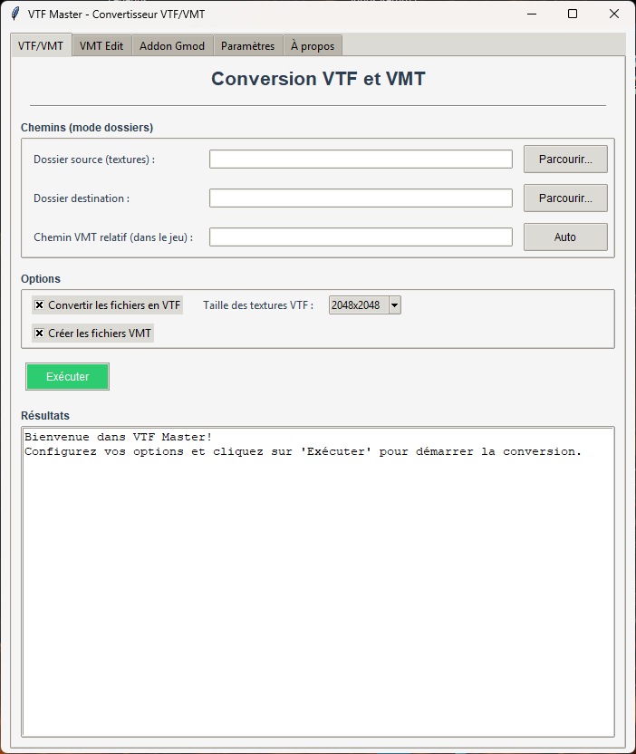
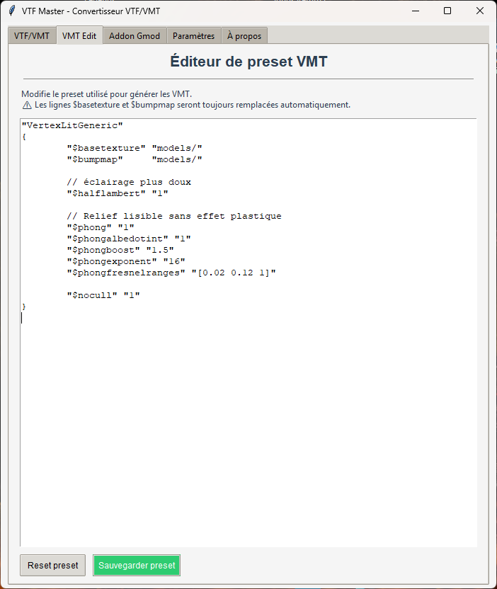
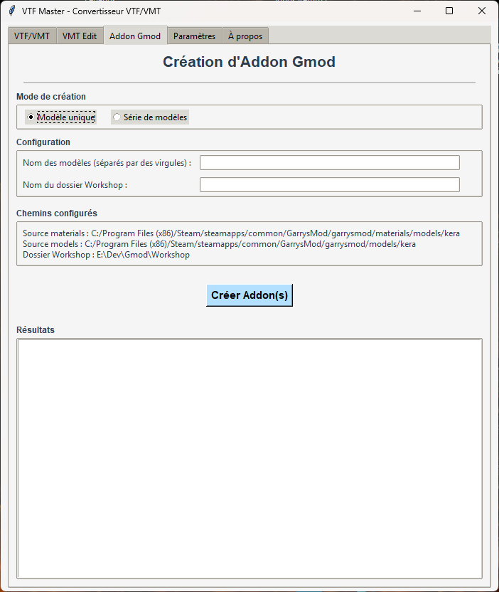

# VTF Master

VTF Master est un outil graphique permettant de convertir des images en VTF et de générer automatiquement des fichiers VMT pour Garry’s Mod.  
VTF Master is a graphical tool that converts images to VTF and automatically generates VMT files for Garry’s Mod.

---

## 🖼 Interface

### 🏠 Conversion VTF / VMT

  

---

### ✏️ VMT Edit

  

---

### 📦 Addon Builder

  

---

## FR Description

VTF Master simplifie le workflow de création de textures pour GMod.

Fonctionnalités principales :

- Conversion PNG / JPG / TGA / BMP / DDS vers VTF
- Détection automatique des textures Diffuse et Normal
- Génération automatique des fichiers VMT
- Calcul automatique du chemin relatif depuis le dossier "materials"
- Preset VMT entièrement éditable via l’onglet "VMT Edit"
- Bouton Reset pour restaurer le preset par défaut
- Support multilingue (Français / English)
- Création automatisée d’addons Garry’s Mod
- Compatible compilation PyInstaller (.exe standalone)

---

## EN Description

VTF Master simplifies the texture workflow for GMod.

Main features:

- PNG / JPG / TGA / BMP / DDS to VTF conversion
- Automatic Diffuse and Normal map detection
- Automatic VMT generation
- Automatic relative path calculation from the "materials" folder
- Fully editable VMT preset via the "VMT Edit" tab
- Reset button to restore default preset
- Multi-language support (French / English)
- Automated Garry’s Mod addon creation
- PyInstaller compatible (.exe standalone)

---

## Version

Current version: 3.0.0

New in 3.0.0:
- Added VMT Edit tab
- Editable VMT preset system
- Dynamic language selection
- External preset auto-save
- Various stability improvements

---

Author: Kera
